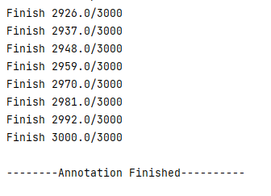

# scRare

## Introduction

scRare, a neural network framework for novel rare cell detection, provides a fast, accurate and user-friendly novel rare cell detection for a new single-cell RNA-seq profile. By leveraging the newly designed neural network structure and proposed two new score functions, scRare especially obtains an outperformance on novel rare cell detection((up to 16.26% more AUROC compared to the second-best method). 

## Requirement

- Scanpy (Compatible with all versions)
- Pytorch (With Cudatoolkit is recommended)
- Numpy > 1.20
- Pandas > 1.2


## Installation

```Python
pip install scNovel==1.1.0
```

## Tutorial


[scNovel Tutorial](Experiments/scNovel_Tutorial.ipynb)


### 0. Data Format

```
single-cell data: The format is the same as Experiments/darmanis_counts.csv
label: The format is the same as Experiments/darmanis_label.csv
```


### 1. Load Data

```Python
import scanpy as sc
import numpy as np
train_label = sc.read_csv('train_label.csv',dtype="str")
train_adata = sc.read_csv("train_adata.csv")
test_adata=sc.read_csv("test_adata.csv")
train_label =train_label .to_df()
train_adata =train_adata.to_df()
test_adata=test_adata.to_df()

#scanpy process
sc.pp.normalize_total(train_adata, target_sum=1e4)
sc.pp.log1p(train_adata)

sc.pp.normalize_total(test_adata, target_sum=1e4)
sc.pp.log1p(test_adata)
```


### 2. Run With scNovel. 

```Python
import scNovel as sr
pred_result = sr.scNovel(test_adata, train_adata, train_label, processing_unit)
```

in which 

- **test=The expression matrix of the sample to be annotated**,
- **reference=The expression matrix of the labeled dataset (reference set),** 
- **label = label vector (in pandas structure)**,
- **processing_unit = 'cpu'(Default)/'gpu'**. If no changes, the default processor will be CPU. We highly recommend setting as 'gpu' if your server supports.

Column name can be anything.

### 2. Waiting for the progress bar to finish.



## Tutorial With Your Own Dataset

- [scNovel Tutorial With Custom Dataset and Training](Experiments/scNovel_Tutorial_OwnDataset.ipynb)

## Citation
```
scNovel: a neural netowrk framework for novel rare cell detection of single-cell transcriptome data. Chuanyang Zheng, Yuqi Cheng, Xuesong Wang, Yixuan, Wang, Hongxin Wei, Yu Li.
```
